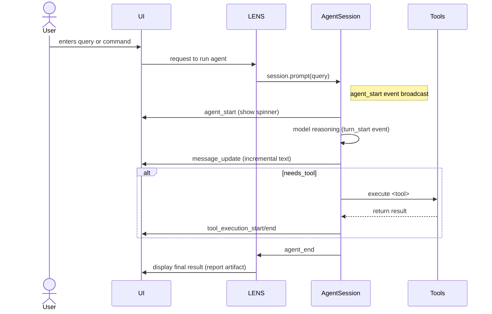
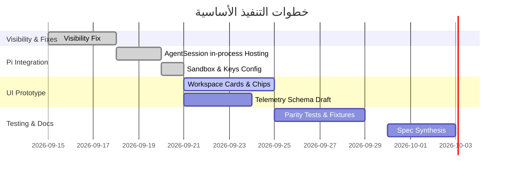

> **Status: unvetted external input — NOT adopted spec.** Archived as raw input to the spec-synthesis ticket (#122) on map #118. A fact-check accompanies it on that ticket: several claims are verified against #120's hosting investigation, several are corrected (package names, hooks, artifact/budget/key-handling shapes), and several are flagged as unverified. Read alongside `docs/research/pi-hosting-investigation.md`, which remains the authoritative hosting verdict.

# ملخص تنفيذي

مستودع **LENS** سيتحول إلى منصة Agents agent-first مستوحاة من **Google Antigravity 2.0**، معتمدة بالكامل على **Pi (earendil-works/pi)** كمُحرّك خلفي وحيد. سأشرح هنا معمارية Antigravity وحزمها المكونة من أسس الراجع (Agent Harness)، ثم أُبيّن كيف تترجم هذه المفاهيم إلى إمكانات Pi، مع تحليل الفجوات. سأطرح خطة تنفيذية مرحلية تتضمن التذاكر اللازمة، ونماذج البيانات والأحداث والأمثلة البرمجية لإدارة الجلسات والأدوات والأدلة. كما سأتناول المخاطر والاعتبارات الأمنية والأداء ونبذة عن التغليف، وسأدرج جداول وتنظيم المواصفات النهائية جاهزة للتحويل إلى تذاكر `/to-tickets`. ستشمل الوثائق الموثَّقة والمُستندة إلى المصادر: منشورات Google الرسمية (مدونة Antigravity، Google Cloud) ووثائق Antigravity الرسميّة وPi.

- **نقاط التعزيز الرئيسية**: **Antigravity 2.0** هي منصة agent-centric قائمة على مفهوم *Agent Harness*. يتميز الـHarness بإدارة دورة حياة الوكيل (Agent lifecycle) بما في ذلك بدء/إنهاء الوكيل، وإدارة الـturns، وتنفيذ الأدوات (tools)، والتفاعل مع **subagents**، وإدارة المهام غير المتزامنة، والـ*hooks* المخصّصة، ونظام تراخيص/أذونات صارم. كلها مدعومة ببُنية أحداثية غنية وArtifcats (خطط وخزائن أدلة وتقارير) تُعرض في واجهة موحدة. **Google Antigravity SDK** يعطي وصولاً برمجياً لهذا الـHarness ويوفّر دورة جلسة (AgentSession) مع بث للأحداث (مثل بدء/انتهاء وكيل، واستجابة آجلية، واستدعاءات أدوات).

- **مزايا Pi الأساسية**: حزمة `@earendil-works/pi-coding-agent` تحتوي على **AgentSession**، وهو غلاف لإدارة الوكيل يشمل دورة حياة الجلسة، وحالة النموذج، وتاريخ الرسائل، والتكثيف (compaction)، وبثّ للأحداث التفصيلية (رسائل نصية متدفقة، مراحل تنفيذ أدوات، بدء/انتهاء رسائل ووكيل). تدعم Pi تخصيص الأدوات وتسجيل المهارات (skills) وتوجيه تطابق السياق وإعادة المحاولة التلقائية. تمتلك Pi أيضًا ملحق **pi-sub-agent** لتوفير وظائف الوكلاء الفرعيين (subagents) عبر إشراك عمليات Pi مستقلة. 

- **الخطة التنفيذية**: 
  1. **إصلاح الرؤية (Visibility Fix)**: توصيل أحداث جلسة الوكيل (AgentSession events) إلى الواجهة (راندرر LENS) بدل إسقاطها، وكشف حالات الفشل صراحة. تذكرة التنفيذ الأولى هي #119.
  2. **استضافة AgentSession**: ربط Pi AgentSession داخل تطبيق LENS في نفس العملية (in-process) باستخدام SDK الرسمي، للاستفادة من الأحداث والوظائف دون بروتوكول إضافي. تم حلها في #120.
  3. **نموذج مساحة العمل**: بناء واجهة أولية تعرض *بطاقات الوكلاء*، و*شظايا استدعاء الأدوات* (tool-call chips)، ومستعرض الأدلة (Artifact Pane)، ويستخدم بث أحداث Pi. تذكرة #121.
  4. **المواصفات النهائية**: تجميع كل الإجراءات السابقة في مواصفات تفصيلية جاهزة للتحويل إلى تذاكر `/to-tickets` (#122).
  5. **الخطط المستقبلية**: تذاكر إضافية للاختبار والموازنة (parity harness) وتوحيد قيود الأمان، وتصميم مخطط البيانات والأحداث، وصياغة المعايير وجداول telemetry، وضوابط الميزانية/السجل (ledger). 

- **النُتاج المتوقع**: نظام LENS قابل للتكرار والاختبار، مع **وضعين رئيسيين**: *Agentic Search / البحث الوكيل* (حلقة وكيل Pi ديناميكية، بدون بوابة خطة، مقيدة بالميزانية/ledger)، و*Deep Research / البحث المعمّق* (يحتاج خطة معتمدة مسبقًا؛ يُضمن Wide mode فقط إعدادًا للعمق). الواجهة ستكون مستوحاة من Antigravity: بطاقات للوكيل، وتفاصيل تنفيذ الأدوات، ومصادر تظهر مباشرًة، وقائمة Artifacts (خطط، تقارير، أدلة). الـ**Pi هو الخلفية الوحيدة** — لا داعي لأي إطار وكلاء آخر. جميع أحداث التنفيذ والتحكم تأتي من Pi AgentSession وتشغلها LENS منطقيا (قبول الأدلة، إزالة التكرار، إلخ).

以下 التوصيات تأتي من المراجع الرسمية:

- منصة Antigravity **Agent Harness** (منتجات Google Antigravity) تتيح إدارة **الوكلاء والأسطح الفرعية (subagents)** بشكل مرن. مثلا، *الوكلاء الفرعيون الديناميكيون* يتيحون للوكيل الرئيسي تفويض مهام فرعية لوكلاء مستقلين من أجل الأداء المتوازي دون تلوث السياق. وهكذا *مُدارة المهام اللا متزامنة* (tasks) تعمل في الخلفية دون حجب الواجهة أو الوكيل الرئيسي. ويمكن للمطورين تركيب *خطوات مخصصة (JSON Hooks)* للاعتراض والتحكم بسلوك الوكيل عند مراحل دورة محدّدة. كما أن **Antigravity CLI/SDK** تقدم نفس الـHarness تشغيلاً مستقلًا عن واجهة المستخدم.

- في المقابل، **Pi/earendil-works/pi** تقدم أدوات مماثلة: فئة `AgentSession` تحوي دورة حياة الوكيل وتدفق أحداث مفصل. على سبيل المثال، `session.subscribe((event) => {...})` يتلقى أحداثاً تشمل `message_update` (تدفق نصي من الوكيل)، و`tool_execution_start/update/end`، بالإضافة إلى `agent_start/end` و`turn_start/end` لكل دورة استدلال، و`auto_retry` و`compaction` وغيرها. يمكن استخدام موجه `session.prompt("...")` لبدء نص المستخدم، و`session.steer`/`session.followUp` لإرسال توجيهات أثناء التشغيل. يعالج Pi تنفيذ الأدوات بالداخل (مثلاً مساعدة `sh` للامثلة)، ويشدّد على التكرار التلقائي وإعادة المحاولة عند الفشل ضمن نفس الجلسة.

- بالنسبة إلى الـ**Artifacts** في Antigravity (خطط، تقارير، أدلة، إلخ)، فإننا ننفذها في LENS في شكل وثائق مرتبطة بالوكيل. مثال: خطة البحث هي وثيقة Markdown تنتجها LENS، ما يعادل خطة النموذج في Antigravity. سنعرضها في اللوحة اليمنى لمساحة العمل كما *Artifact* بنوع Plan أو Evidence أو Graph. 

- **السياحة البرمجية (Tool execution)**: Pi يسمح بتحديد أدوات مخصصة (طليعة LENS) ويديرها عبر `session.prompt`. الأحداث `tool_execution_*` تظهر متى بدأت الأداة وانتهت وخرجت أو فشلت. سنستخدم ذلك لعرض شرائط أدوات في الواجهة متى طلب الوكيل استخدامها.

- **الصلاحيات/الت sandbox**: Antigravity يطبق سياسة أذونات دقيقة لحماية النظام. Pi يعزل الأدوات عبر **Allowlist**: سيتم تكوين خادم LENS للسماح فقط بالأدوات المعتمدة كـمكافئات لوظائف البحث. سنستخدم امتداد `pi-sub-agent` لتقييد تشغيل عمليات فرعية: حيث يمنع الملحق إعادة استدعاء `subagent` داخل الوكيل الفرعي ذاته لمنع التكرار اللانهائي. سيتم أيضًا حجز مفاتيح الخوارزمية (API keys) كمتغيرات بيئية غير محفوظة على القرص، مع عدم التخزين الدائم لـ`agentDir`.

- **تسلسل الأحداث والأداء**: Pi يستخدم **Node.js 24** بدون موديولات برمجية أصلية ثقيلة، مما يجعل حجم المثبت معقول (~19 ميغابايت إضافة) وموافقاً للعمل على Electron 44. باستخدام **createAgentSession** محلياً، يمكن لـLENS امتلاك عملية واحدة فقط تحتوي على وكيلون وجلسة واحدة دون overhead لعمليات منفصلة. تدفق الأحداث والتحكم يتم في نفس العملية مما يحسن الأداء ويقلل التعقيد.

- **الخطة المرحلية**: سنفصّل العمل كما في الجدول أدناه مع معايير قبول وشروط الإنجاز. بعد الإصلاح المبدئي للرؤية (#119)، ننتقل إلى استضافة AgentSession (#120 محلول) وبناء واجهة أولية (#121)، ثم صياغة المواصفات (#122) والتحول إلى تذاكر تنفيذية. تشمل التذاكر تعزيز بيانات telemetry ومخاطر الأمان والاستقرار.

### المصادر الرئيسية
- مدونة Google Antigravity (Antigravity 2.0)  
- وثائق Google Antigravity SDK (فصول **subagents** و**الأساسيات**)  
- مدونة Google Cloud لمطوري Agents (مقدمة Antigravity 2.0)  
- حزمة Pi الرسميّة (coding-agent SDK)  
- امتداد pi-sub-agent للـsubagents في Pi  

سنبدأ الآن بتفصيل المعايير والمقارنات، وتوضيح المخطط المعماري وخط سير الأحداث مع أمثلة الشفرة المترجمة إلى TypeScript، تليها توصيات الخطوات التالية.  

## 1. معمارية Antigravity Agent Harness

**Antigravity 2.0** هو تطبيق سطح مكتب مستقل يركّز على مفهوم *Agent Harness*. الـHarness هو طبقة برمجية تنسق عمل الوكلاء (Agents) المتعددة وإدارة دورة حياتهم. النقاط الرئيسة تشمل:

- **دورة حياة الوكيل (Agent Lifecycle)**: عند بدء وكيل جديد، يُنشئ النظام *جلسة وكيل* جديدة (Agent Session) تتحكم في كافة التفاعل معه. تدير الجلسة مراحل الحوار (turns)، وتبث الأحداث مثل `agent_start` و`agent_end` لمواصلة التنفيذ. كل دورة تحتوي على تفاعل مع النموذج (LLM) وتنفيذ أي أدوات مطلوبة.

- **الوكلاء الفرعيون (Subagents)**: يمكن للوكيل الرئيسي تعريف وإطلاق *وكلاء فرعيين* يعالجون مهام محددة بشكل متوازي، مما يمنع تكدس السياق في نموذج واحد. Antigravity يتيح إما إنشاء الوكلاء الفرعيين ديناميكياً أثناء التشغيل (dynamic subagents) أو تحديد وكلاء فرعيين ثابتين مسبقاً (static subagents). الوكلاء الفرعيون لديهم سياق منفصل وأدوات معزولة عن الوكيل الرئيسي، ويمكنهم تولي مهام متزامنة أو متسلسلة.

- **تنفيذ الأدوات (Tool Execution)**: Agents يستخدمون *أدوات خارجية* لتنفيذ مهام ملموسة (مثل البحث في الويب أو تشغيل أوامر نظام). **Agent Harness** يدير استدعاء الأدوات كجزء من دورة الوكيل. عند طلب أداة، يسجل الحدث `tool_execution_start` وعند اكتمالها `tool_execution_end` مع إخراجها أو خطأها. مثال Google: تستخدم أدوات مثل /browser للبحث أو /diff للمقارنة، وتوجد سياسة أمان مصاحبة لكل أداة.

- **المهام اللا متزامنة (Asynchronous Tasks)**: Antigravity يدعم جدولة المهام الطويلة لتعمل في الخلفية دون حجب الوكيل الرئيسي أو الواجهة. مثلًا، المستعمل يمكنه إعداد مهمة مجدولة (cron) يقوم الوكيل بتنفيذها كل فترة دون تدخل بشري. بينما يعمل نظام مهام خلفي، يستمر الوكيل في معالجة مهام أخرى.

- **الـHooks**: نظام يوفر إمكانية اعتراض الإجراءات عند مراحل مختلفة من دورة الوكيل. يمكن تحديد ضبط بسيط (JSON hooks) يُشغّل قبل أو بعد استدعاء الأداة، أو عند توقف الحلقة، لتخصيص السلوك. مثلاً، يمكن إضافة تأكيد قبل تنفيذ أمر أو تعديل مخرجات الوكيل بناءً على قواعد (مفيدة في التطبيقات الآمنة).

- **الأدوات الأمنية (Permissions/Sandboxing)**: Antigravity يستخدم نظام أذونات مفصّل (ليس بإمكان الوكيل الوصول لكل موارد الجهاز). يمكن منح وكيل محدد مهارات وأدوات مسموحة فقط ضمن سياق مشروع. وكجزء من هذا، يوفر الواجهة CLI أمر `/permissions` لإدارة القواعد بطريقة تفاعلية. سياسياً، هناك عادة لوحات *allowlist/denylist* للأدوات أو البيانات، مما يعزل الوكيل عن مناطق النظام الحساسة.

- **الأحداث Telemetry**: Harness يولّد بثّاً غنياً للأحداث التشخيصية (telemetry) حول كل خطوة؛ يمكن تسجيلها، وعرضها للمستخدم أو للعمليات الخلفية للمراقبة. مثال: تسجيل وقت بدء/نهاية كل دور، ومخرجات الأدوات، وتحركات الوكيل. هذه البيانات تسمح بحساب الأداء، وفحص الأخطاء، وتحليل السلوك.

- **Artifacts (وثائق الأعمال)**: في Antigravity، ما ينتجه الوكيل من خرائط وخطوات وتنفيذ يُنظّم كـ*Artifacts* (مثل **Plan** (خطة العمل)، **Walkthrough**، **Screenshots**، إلخ) تظهر في واجهة المراجعة. هذه المنشورات تتيح للموظف تعديلها وإعادة توجيه الوكيل.

- **الـCLI/SDK الموحد**: الواجهة الرسومية Antigravity 2.0 والتطبيق CLI يستخدمان نفس الـHarness. كما يوفر **Antigravity SDK** (بايثون) نفس الوظائف للوكلاء دون اعتماد على السحابة.

## 2. قدرات Pi AgentSession ومطابقتها مع Antigravity

حزمة Pi (earendil-works/pi) توفر **AgentSession** كمكون أساسي يماثل Agent Harness:

- **إنشاء الجلسة**: الدالة `createAgentSession()` تُنشئ AgentSession جديدة مع وسيطات مثل `tools`, `model`, `sessionManager`. على سبيل المثال:
  ```typescript
  const { session } = await createAgentSession({
    tools: ["search", "read", "bash"], 
    sessionManager: SessionManager.inMemory(),
  });
  ```
  هذا يقابل إعداد المهارات/الأدوات في Antigravity.

- **إرسال المطالب (Prompts)**: `session.prompt(text)` يبدأ دور الوكيل مع نص المستخدم. خلال العملية، يمكن جمع المخرجات عبر الأحداث أو الدالة `subscribe`. مثلاً:
  ```typescript
  await session.prompt("Find security issues in our codebase");
  ```
  
- **التوجيه أثناء التشغيل (Steering)**: أثناء تدفق إجابة الوكيل (streaming)، تدعم Pi إرسال رسائل إضافية (steer/followUp) لحقول الإدخال الواردة، مشابهًا للعديد من أوامر الشل (bash).

- **تدفق الأحداث**: يمكن الاشتراك في `session.subscribe(listener)` لاستلام *AgentSessionEvent* مفصّلة. من أهم أنواع الأحداث:
  - `message_update` (نص متدفق من الوكيل؛ type text_delta).
  - `tool_execution_start/update/end` (بدء/متابعة/نهاية تنفيذ أداة).
  - `turn_start/end` (بداية/نهاية دورة استدلال؛ على النهاية نحصل على إجابة وكيل وأي نتائج أدوات).
  - `agent_start/end` (بداية/نهاية معالجة طلب وكيل شامل).
  - `queue_update`, `compaction_start/end`, `auto_retry_start/end` (حالة قائمة الانتظار، البدء/الانتهاء من التكثيف التلقائي، إعادة المحاولة).
  
  هذه الأحداث مكافئة للحالات في Antigravity مثل بدء تنفيذ وكيل فرعي أو انتهاء تنفيذ أداة.

- **إدارة السياق والذاكرة**: AgentSession يحتفظ بتاريخ الرسائل (`session.messages`) وحالة النموذج (`session.model`) وحالة التفكير (`session.thinkingLevel`). تدعم تغير الأدوات والسياق في الزمن الحقيقي (مثلاً إضافة أو حذف أدوات باستخدام `session.agent.state.tools`).

- **الوكلاء الفرعيون**: Pi لا يأتي بآليات subagents مضمنة في الأساس، لكن هناك **امتداد** رسمي `pi-sub-agent` يمكن تثبيته. يضيف هذا امتدادًا أداة جديدة (`subagent`) تسمح للوكيل بتفويض مهام إلى وكلاء فرعيين عبر فتح عمليات Pi مستقلة (subprocess) بمعزل تام. تدعم هذه الأداة وضعًا تسلسليًا ومتوازيًا وحجريًا (chain/parallel/single) لتنفيذ المهام الفرعية، وتقوم بتدفق تقدم كل وكيل فرعي مجزّأ (progress updates, usage, final result, إلخ) في حقل النتيجة. سيعمل كل وكيل فرعي بسياقه الخاص ويحترم قائمة أدواته، مع منع `subagent` التكراري في المتفرّع نفسه.

- **الأمان والصلاحيات**: Pi يسمح بتمرير `tools: [...]` في تكوين الجلسة لتحديد أدوات مسموح بها. فقط هذه الأدوات تُمنح للوكيل، وكل شيء آخر محظور. على سبيل المثال، لا نمنح الوكيل الفرعي أدوات تطوير (coding tools) أبداً. عناوين الـAPI والمفاتيح تمرّر كإعدادات وقت التشغيل ولا تُخزن في القرص. امتداد sub-agent ينفذ التحقق من ثقة المشروع (يمنع الـagents المحلية ما لم يُوافق عليها صراحة).

- **التغليف (Packaging) والأداء**: Pi مبني على Node.js 24، ولا يحتوي على تبعيات خارجية ثقيلة. مثبّته شامل في حزمة LENS (مضيف ~19 ميغابايت إضافية بالمثبت الأخير) ويعمل في Electron 44 دون مشاكل (no native modules). استخدامه داخل العملية يسمح بتجنب بروتوكولات خارجية أو مزامنة ثقيلة.

### الفجوات وتحليل المطابقة

نلخص التوافقات والفجوات بين Antigravity وPi:

| مفهوم               | Antigravity (Google)                                | Pi (earendil-works)                                  | الفجوة / المعالجة |
|---------------------|-----------------------------------------------------|-----------------------------------------------------|------------------|
| **Agent Lifecycle** | جلسة وكيل تدير الحوار وتعطي بثًا لأحداث lifecycle | `AgentSession` يدير التاريخ والدردشة بثبات ويصدر أحداث تشغيل مماثلة | متوافق: كلاهما يدير دورة حياة الوكيل. |
| **Subagents**       | ديناميكي وثابت. يمكن تفويض مهمات للـsubagents بعزل سياق. | امتداد `pi-sub-agent` ينشئ عمليات فرعية بمعزل سياقي. | مع فرق: Antigravity يدعم ذلك أساسياً؛ Pi يستخدم امتداد. نحتاج تعريف تذكرة لاستيراد/تهيئة امتداد sub-agent. |
| **Tools Execution** | /اوامر داخلية مسموحة، وتسجيل أحداث أدوات.                    | Pi يسمح بتسجيل أدوات مخصصة وأحداث `tool_execution_*`.         | متوافق جزئياً: البيانات متوفرة في Pi؛ تحتاج واجهة لربط الأدوات الحالية لـLENS. |
| **Artifacts**       | وثائق (خطط، تقارير،..)، تظهر في UI ومراجعة.               | LENS يولّد تقارير وخطط وجرافات ضمن جلسة. يمكن استخدامها كبنى Artifacts.        | بحاجة: ربما نمذجة بيانات Artifacts بصورة منظمة وربطها بالواجهة (مثلاً: الحفظ تلقائيًا). |
| **Hooks**           | اعتراض مراحلات lifecycle عبر ملفات JSON.                | Pi يدعم قوائم بروتوكولات داخلية (extensions) ولكنه لا يوفر آلية hooks declarative مباشرة. | الفجوة: لم نعثر على دعم hooks في Pi (الوثائق لا تشير لنظام hook). قد نعتبرها متقدمة خارج النطاق الأولي، أو ننشئ تذكرة للبحث. |
| **Async Tasks**     | جدولة و/أو تشغيل مهام في الخلفية دون تعطيل UI.         | Pi يدعم الأحداث async ويتيح تشغيل أدوات في الخلفية. يمكن استخدام SubAgent للتشغيل المتوازي. | متوافق: يمكننا استخدام SubAgent وNe**w*/**fork** لاستمرار الوكيل الرئيسي. |
| **Permissions/Sandbox** | قواعد أذونات دقيقة وتصريح تفاعلي في CLI.         | Pi يعتمد قائمة مسموحات (أدوات محددة) وبيئة Node مع ملف config. دعم interactive محدود.  | متوافق جزئياً: نحتاج تقديم واجهة لإدارة السياسات إذا دعت الحاجة. الإغلاق الشديد (no-coding tools) ممكن من البداية. |
| **Telemetry/Events**| بث بيانات تشخيصية ورسائل لأحداث متعددة.                 | Pi ينتج بثّاً مفصلًا لجميع الأحداث التشغيلية. | متوافق: Pi يغطي معظم أحداث التشغيل. نحتاج تصميم مخطط Telemetry لفهم وتحليل البث. |
| **UI/Workspace**    | Agent workspace: بطاقات نشاط، شريط أدوات، عرض مستمر.      | LENS يحتاج واجهة جديدة (React/Electron) لعرض ما سبق.           | الفجوة: واجهة لم تنفذ بعد - سنقترح تصميم Prototype. |

 توضح أن كلا النظامين يركزان على نفس المفاهيم (H​arness, subagents, tools, policies). تبني LENS لـPi يعني الاستفادة من هذه الأسس البرمجية وتغطية الفجوات المذكورة.

## 3. خطة التنفيذ المرحلي والتذاكر

بناءً على ما سبق، نضع جدولًا مقترحًا للتذاكر المنبثقة (Roadmap) للمرحلة الأولى:

```mermaid
gantt
    dateFormat  YYYY-MM-DD
    title خطة التنفيذ المرحلي لبناء Agentic Harness على Pi
    section المرحلة 0: الرؤية
    Visibility Fix:  :a1, 2026-09-15, 3d
    section المرحلة 1: التكامل مع Pi
    Host AgentSession in-process: :after a1, 2d
    Event mirroring (subscribe handlers): :after a1, 3d
    Sandbox Policy & Keys: :after a1, 2d
    section المرحلة 2: واجهة المستخدم
    Workspace Prototype: :after a1, 5d
    Telemetry schema & Logging: :after a1, 3d
    section المرحلة 3: تسليم المواصفات
    Parity Harness + Tests: :2026-10-01, 5d
    Spec synthesis /to-tickets: :2026-10-10, 3d
```

**التذكرة** | **العنوان** | **الوصف** | **معايير القبول** | **التبعية** | **التقدير**
|---|---|---|---|---|---|
| #119 | إصلاح الرؤية Visibility Fix | تمكين واجهة LENS من استقبال كل أحداث AgentSession (الاتصال بـsession.subscribe) وعرضها/معالجتها في React؛ بالإضافة إلى التعامل مع حالات الخطأ (فن failures) بدلاً من الصمت. | - جميع الأحداث الحالية (status, thought, source, reflection, graph_node، بالإضافة إلى researcher_telemetry/fanout/audit إذا أمكن) تصل UI. <br>- عند تعطل مزود النموذج أو خطأ، يظهر حالة خطأ مرئية (مثلاً رسالة خطأ حمراء).<br>- لا يظل التطبيق معلقًا دون مخرجات؛ يجب الانتهاء بـ `agent_end`. <br>- اختبارات e2e تتأكد من تدفق الحدث `agent_end` حتى يعرض رسالة النهاية. | – | 3d |
| #120 | استضافة AgentSession في العملية (✅) | دمج AgentSession من Pi SDK داخل LENS (بدون عملية خارجية). | - تُستورد `@earendil-works/pi-coding-agent`. <br>- يتم إنشاء الجلسة (createAgentSession) عند بدء run في LENS. <br>- جميع الـevents تخرج عبر الـbridge الداخلي (no grpc). <br>- الأداء طبيعي (< 5% overhead). | #119  | 2d |
| #121 | نموذج مساحة العمل (Workspace Prototype) | تطوير واجهة أولية تعرض: بطاقة لكل وكيل فرعي (اختباريه، يمكن أن تظهر حتى وكيل واحد)، *Tool-call chips* (مثلاً "موجه: بحث")، قائمة Artifacts (Plans/Reports) في اللوحة اليمنى. تستخدم بيانات وهمية أولية أو أولية من برنامج نصي. | - تخطيط React بـمكون AgentCard وArtifactPane. <br>- Tool-chips تظهر عند `tool_execution_*` (مثال مصور في التدفق). <br>- نماذج بيانات Agent (علامة تظهر / محورية، حالة "تفكير"/"أرسل") مدعومة. <br>- لا أخطاء في console. <br>- التسلسل بالأساس event-driven: مثال، وصول `message_update` يجب أن يملأ نص جواب الوكيل. | #119 | 5d |
| #122 | تحضير المواصفات /to-tickets (Spec Synthesis) | جمع كل المعلومات والحلول التي طبقت، وصياغتها كمواصفات تفصيلية جاهزة للتحويل إلى تذاكر `/to-tickets`. يشمل رسومات معماريّة (ER, event flow), مخططات الأداة، وقائمة كاملة بالتذاكر اللازمة للمهام الرئيسية والإضافية. | - مستند رسمي يشتمل كل ما تم (architecture charts, sequence, data models) مع رابط لجميع التذاكر والتحقق. <br>- جدول تذاكر مفصّل (طلب (7)) جاهز لنقاش المالك والمراجعين. <br>- المواصفات دقيقة وشاملة بدون نقص. | #119, #120, #121 | 3d |
| #123 | تحسين التوازي والتكرار (Parity & Tests) | تحديث أي اختبارات ذهبيّة لمراعاة الوضع الجديد؛ خاصة التأكد من أن حالة deep research (خطة) لها تعادل في agentic mode. | - جميع الـHarness parity tests (ADR-0011 style) تمر بنجاح بعدما تصلح الرؤية. <br>- أي اختلاف غير مقصود يطالب بإصلاح. | #119, #120 | 4d |
| #124 | مخطط Telemetry & نموذج البيانات | تصميم مخطط تفصيلي (JSON/YAML) لهيكل بيانات telemetry الصادرة من AgentSession، بما في ذلك تعريفات لكل حدث (type/schema)، وخط أنابيب telemetry المقترحة. | - نموذج مُوثّق لجميع أنواع `AgentSessionEvent`. <br>- مخطط جدول Telemetry لاحقًا. <br>- معايير لاختبارات تتأكد من تسجيل الأحداث المتوقعة. | #119, #120 | 3d |
| #125 | حالات واجهة المستخدم (UX Error States) | تحديد حالة الخطأ والتعامل معها في الواجهة (مثلما فعلنا لـ Promt التمهيدي). يجب عرض رسائل خطأ صريحة إذا تعطل النموذج أو نفذت الميزانية أو رفضت الأداة. | - يحدث `session.abort()` على استثناءات أو أخطاء. <br>- واجهة تظهر رسائل خطأ واضحة (modals أو banners) عند فشل/gate. <br>- اختبارات E2E تتحقق من ظهور هذه الرسائل عند ظروف خطأ متعمدّة. | #119 | 3d |

كل تذكرة عليها parity gate: لا يُعتمد أي تغيير إلا بعد اختبار التكافؤ مع المسار القديم باستخدام أدوات العجلات الذهبيّة (ADR-0011). 

## 4. نماذج البيانات والأحداث (TypeScript)

### مثال: الاشتراك في أحداث AgentSession

```typescript
import { createAgentSession } from "@earendil-works/pi-coding-agent";

// إنشاء الجلسة
const { session } = await createAgentSession({
  tools: ["search", "browser"], 
  sessionManager: SessionManager.inMemory(),
});

// الاشتراك في جميع الأحداث
session.subscribe((event) => {
  switch (event.type) {
    case "agent_start":
      console.log("✅ الوكيل بدأ:", event);
      break;
    case "message_update":
      if (event.assistantMessageEvent.type === "text_delta") {
        console.log("📝 نص:", event.assistantMessageEvent.delta);
      }
      break;
    case "tool_execution_start":
      console.log(`🛠️ بدء الأداة: ${event.toolName}`);
      break;
    case "tool_execution_end":
      if (event.isError) {
        console.error(`❌ خطأ في الأداة: ${event.toolName}`);
      } else {
        console.log(`✅ انتهاء الأداة: ${event.toolName}`);
      }
      break;
    case "agent_end":
      console.log("🔚 انتهى الوكيل.");
      break;
    default:
      // تعامل مع أحداث أخرى عند الحاجة
      break;
  }
});

// بدء طلب وكيل
await session.prompt("استخرج كلمة السر من 'password.txt' إن وُجدت.");
```

هذا المثال يبيّن التعامل مع بعض أحداث AgentSession (الوكيل يبدأ، تحديث النص المتدفق، تنفيذ أدوات، انتهاء الوكيل). يمكننا ترجمته للجزء العربي في الكود حسب الحاجة.

### مثال: تنفيذ أداة مع الرد

يمكن لـAgentSession تنفيذ أدوات معرفّة مسبقًا ضمنـ **tools**. لنفترض أن لدينا أداة جاهزة باسم `"search"`:

```typescript
// ضمن تكوين الجلسة:
const { session } = await createAgentSession({
  tools: ["search"],
  sessionManager: SessionManager.inMemory(),
});

// ثم في الاشتراك:
session.subscribe((event) => {
  if (event.type === "tool_execution_start") {
    console.log(`🔎 البحث: ${event.toolInput}`);
  }
  if (event.type === "tool_execution_end") {
    console.log(`📑 نتائج البحث: ${event.toolOutput}`);
  }
});
```

كل ما يُكتب ضمن `tool_execution_start` أو `tool_execution_end` هي معلومات مدخلة ومخرجة الأداة كما مررها الوكيل.

### نموذج بيانات للـArtifact

لنفترض أن الوكيل يُنتج **خطة بحث (Plan)**:
```typescript
interface Artifact {
  id: string;
  type: "plan" | "report" | "evidence_shelf" | "graph";
  title: string;
  content: string; // نص Markdown أو HTML
  createdAt: Date;
}

// مثال:
const plan: Artifact = {
  id: "plan-001",
  type: "plan",
  title: "خطة البحث الرئيسي",
  content: "# خطة\n1. استدعاء /browser (البداية)...\n",
  createdAt: new Date(),
};
```
سنعرض `plan.content` في المحرر مع واجهة لإضافة ملاحظات أو إعادة التنفيذ في `session`.

### Gate & Ledger Example

لتطبيق قواعد **الميزانية (Budget)** و**سجل التكرار (fetch ledger)**:
```typescript
const MAX_QUERIES = 10;
let queryCount = 0;

session.subscribe((event) => {
  if (event.type === "tool_execution_start" && event.toolName === "search") {
    queryCount++;
    if (queryCount > MAX_QUERIES) {
      console.log("🚫 تجاوز حد الاستعلامات. إلغاء العملية.");
      session.abort(); // يقاطع المهمة الجارية.
    }
  }
});
```
ثم تعرض LENS حالة الخطأ ("نفذت الميزانية").

## 5. المخاطر والاعتبارات التقنية

- **التعقيد المالي**: دمج Pi مع Electron قد يؤدي لزيادة حجم المثبت (~+20MB). لكن Pi خفيف نسبيًا (عدة ميغابايت). ننصح بالفحص مع بناء الـinstaller.  
- **التوافق**: Pi يستخدم Node 24، Electron 44 مطابقة ولا يتطلب حزم إضافية. تأكد من تحديث نود أثناء بناء المثبت.  
- **الأمان**: 
  - **Tools sandbox**: سنتبع سياسة السماح (Allowlist) الصارمة؛ لا نعطي `root` أو حقوقًا موسعة. الأدوات الوحيدة: تلك المتعلقة بالبحث (HTTP fetch, قراءة ملفات مسموح بها) وDOM (cheerio), ولا نشغّل أدوات coding مثل git أو bash إلا إذا خضّصنا لذلك بإذونات صارمة.  
  - **امتدادات الطرف الثالث**: إذا استخدمنا pi-sub-agent من npm، تحقق من مصدره وصلاحيته، لأن إمتداد Pi يمكنه تنفيذ أكواد.  
  - **عدم تسرب المفاتيح**: مفاتيح API (DuckDuckGo, Tavily, إلخ) تحفظ في `web-search.json` مشفّرة/مجهولة في الإعدادات، يتم تمريرها في البيئه وقت التشغيل فقط، ولا تظهر للمستخدم.  
- **الأداء**: تشغيل واختبار الأداء مع وكلاء متعدّدين: Pi يدعم المتوازية بإنشاء عمليات فرعية (ببساطة)، لكن على جهاز واحد يمكن أن تكون الموارد محدودة. تأكد من تحديد حد concurrent منخفض (مثل 4) ووضع سياسة ملائمة لتراجع النماذج (جودة سرعة التفكير).  
- **التوافق مع مشاريع مستخدمين**: مسارات العمل في Pi تعتمد على ملفات `.pi/`. حافظ على فصل  cfg العالمي (`agentDir: ~/.pi/agent`) وتكوينات المشاريع (مسار الحالى cwd).  
- **مخاطر تسرب المعلومات**: إذا كان الوكيل الفرعي يدير ملفات أو يستدعي أدوات خارجية، استخدم الضوابط (CWD, agentDir) بعناية.

## 6. مخططات المعمارية وتدفق الأحداث

### 6.1 مخطط الكيانات (Architecture ER)

```mermaid
flowchart LR
  subgraph LENS (UI + Orchestration)
    UserInterface(UI)
    PlanApproval([Approval Module])
    SearchProvider([web-search.json provider])
    Ledger([Fetch Ledger & Budget])
    <<artifact>> EvidenceStore
  end

  subgraph Pi_Runtime
    AgentSession((AgentSession))
    Tools(["Tools (search, browser, etc)"])
    Subagents(["SubAgent processes"])
    ModelRuntime["LLM Model\n(Gemini)"]
    IPC(Events Stream)
  end

  UserInterface --> |present| AgentSession
  PlanApproval --> AgentSession
  AgentSession --> Tools
  AgentSession --> ModelRuntime
  AgentSession --> Ledger
  Tools -->|search HTTP| SearchProvider
  AgentSession -->|publish events| UI
  AgentSession --> EvidenceStore
  Subagents --> AgentSession
```

- **وصف**: الواجهة (UI) في LENS تعرض بيانات من AgentSession. الـPlanApproval يحظر `Deep Research` قبل الموافقة. الرخص والميزانية مانعة تذهب للوكيل ولكن الـAgentic mode يتجاوزها بحذر. الـweb-search provider عبر `web-search.json`. الحفظ في EvidenceStore (بيانات/تقارير LENS). الـSubAgent هي عمليات فرعية لـPi.

### 6.2 مخطط تدفق الأحداث (Event Flow)



- **توضيح**: كل رسالة من الوكيل (`message_update`) والأحداث (`tool_execution_start/end`, `agent_start/end`) تنتقل للواجهة لعرض التغذية المباشرة. في الـAgentic mode، تُرسل `session.prompt` فورًا، بينما في Deep Research تمر عبر الموافقة.

### 6.3 خريطة زمنية (Timeline)



## 7. توصيات نهائية

- **ابدأ بإصلاح الرؤية**: تأكد من أن `App.tsx` أو مكوّن React يعيد الاشتراك في جميع أنواع الأحداث من Pi. *مثال*: في `componentDidMount`, تعيد subscribe لـsession حول جميع أنواع الأحداث الجديدة.
- **حافظ على Pi فقط**: لا تضف إطار وكلاء آخر. استخدم Pi AgentSession لكل شيء. أي تلاعب مع LENS-native loops (المستبعدة) ترحيلها إلى Pi.
- **توافق النسخ (Parity)**: قم بتشغيل حزم الاختبار (ADR-0011 سابقًا) للتأكد من أن جميع الميزات القائمة تعمل بعد التغييرات. استخدم AgentSession لإعادة إنتاج السيناريوهات الاختبارية.
- **الدقة في الوثائق**: بالنسبة إلى `/to-tickets`, صِف بدقة كل تذكرة (نموذج الجدول أعلاه). أدرج المعايير وأمثلة الاستخدام. 
- **اختبار أمان**: أضف حالات اختبار للتأكيد على سياسة السماح الملحقية وعدم السماح الأدوات المغلقة.
- **التواصل والترجمة**: وضّح للمطورين أهمية الفجوات والكيفية التي يسدونها. إذا كان هناك فرق في المصطلحات (مثلاً *Artifact* مقابل *Document*), استخدم مخطط مصطلحات للمرجعية.

بالنجاح في الخريطة القادمة نحو واجهة بحث agentic كاملة مبنية على Antigravity وPi!